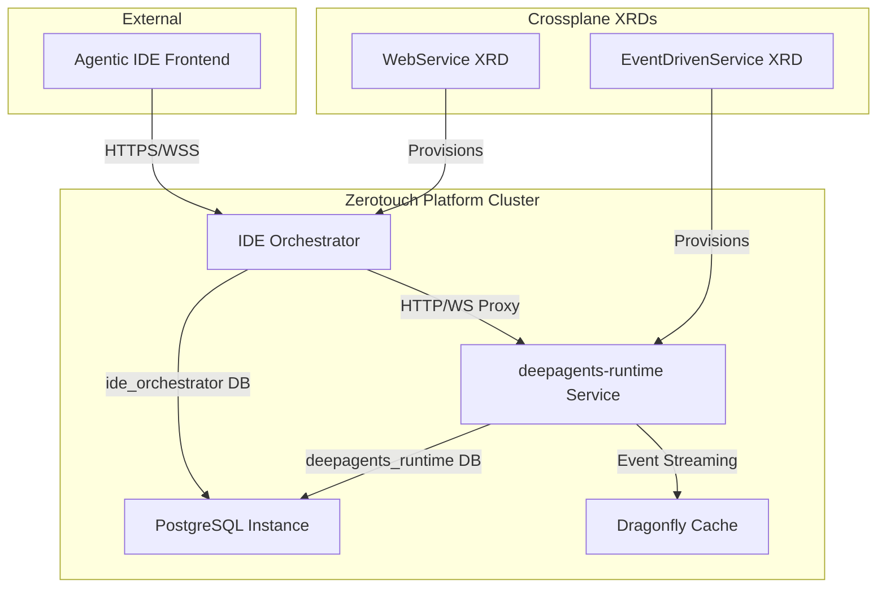

# Design Document - IDE Orchestrator deepagents-runtime Integration

## Overview

This document specifies the detailed design for integrating IDE Orchestrator with the deepagents-runtime service to enable AI-powered workflow specification generation. The integration follows a secure proxy pattern where IDE Orchestrator acts as an authenticated gateway between the frontend and the internal deepagents-runtime service.

The design implements a hybrid event processing approach that combines real-time WebSocket streaming with reliable final state extraction, ensuring both excellent user experience and data consistency.

## Architecture

### System Context



### Component Architecture

#### IDE Orchestrator (Enhanced)
- **Responsibility**: Secure proxy and state manager for specification workflows
- **Technology Stack**: Go + Gin + pgx + Gorilla WebSocket + OpenTelemetry
- **New Features**: WebSocket proxy, deepagents-runtime client, hybrid event processing
- **Database**: `ide_orchestrator` database with proposals, drafts, workflows tables

#### deepagents-runtime Service
- **Responsibility**: AI-powered specification generation using deepagents framework
- **Technology Stack**: Python + FastAPI + LangGraph + deepagents + WebSocket
- **New Endpoints**: `/deepagents-runtime/invoke`, `/deepagents-runtime/stream/{thread_id}`, `/deepagents-runtime/state/{thread_id}`
- **Database**: `deepagents_runtime` database with checkpoints tables

## Components and Interfaces

### deepagents-runtime Service Endpoints

#### REST API Endpoints

**POST /deepagents-runtime/invoke**
```json
{
  "trace_id": "uuid",
  "job_id": "uuid", 
  "agent_definition": {...},
  "input_payload": {
    "messages": [{"role": "user", "content": "refinement prompt"}]
  }
}

Response:
{
  "thread_id": "uuid",
  "status": "started"
}
```

**GET /deepagents-runtime/state/{thread_id}**
```json
Response:
{
  "thread_id": "uuid",
  "status": "completed|failed|running",
  "result": {...},
  "generated_files": {...}
}
```

#### WebSocket Streaming Endpoint

**GET /deepagents-runtime/stream/{thread_id}**

Event Format:
```json
{
  "event_type": "on_state_update|on_llm_stream|end",
  "data": {
    "messages": "...",
    "files": {
      "/THE_SPEC/constitution.md": {
        "content": ["line1", "line2"],
        "created_at": "2025-01-01T00:00:00Z",
        "modified_at": "2025-01-01T00:00:00Z"
      }
    }
  }
}
```

### IDE Orchestrator Integration

#### deepagents-runtime Client

```go
type DeepAgentsRuntimeClient struct {
    baseURL    string
    httpClient *http.Client
    tracer     trace.Tracer
}

type JobRequest struct {
    TraceID         string                 `json:"trace_id"`
    JobID           string                 `json:"job_id"`
    AgentDefinition map[string]interface{} `json:"agent_definition"`
    InputPayload    InputPayload           `json:"input_payload"`
}

type InputPayload struct {
    Messages []Message `json:"messages"`
}

type Message struct {
    Role    string `json:"role"`
    Content string `json:"content"`
}

func (c *DeepAgentsRuntimeClient) Invoke(ctx context.Context, req JobRequest) (string, error) {
    // POST /deepagents-runtime/invoke
    // Returns thread_id
}

func (c *DeepAgentsRuntimeClient) StreamWebSocket(ctx context.Context, threadID string) (*websocket.Conn, error) {
    // WS /deepagents-runtime/stream/{thread_id}
    // Returns WebSocket connection
}

func (c *DeepAgentsRuntimeClient) GetState(ctx context.Context, threadID string) (*ExecutionState, error) {
    // GET /deepagents-runtime/state/{thread_id}
    // Returns final state (fallback if needed)
}
```

#### WebSocket Proxy Handler

```go
func (h *Handler) StreamRefinement(c *gin.Context) {
    threadID := c.Param("thread_id")
    
    // Validate JWT and authorize access to thread_id
    userID, exists := c.Get("user_id")
    if !exists {
        c.JSON(401, gin.H{"error": "Unauthorized"})
        return
    }
    
    // Verify user owns the proposal for this thread_id
    if !h.orch.CanAccessThread(c.Request.Context(), userID.(string), threadID) {
        c.JSON(403, gin.H{"error": "Forbidden"})
        return
    }
    
    // Upgrade to WebSocket
    upgrader := websocket.Upgrader{
        CheckOrigin: func(r *http.Request) bool {
            return h.isAllowedOrigin(r.Header.Get("Origin"))
        },
    }
    
    clientConn, err := upgrader.Upgrade(c.Writer, c.Request, nil)
    if err != nil {
        return
    }
    defer clientConn.Close()
    
    // Connect to deepagents-runtime WebSocket
    deepAgentsConn, err := h.deepAgentsClient.StreamWebSocket(c.Request.Context(), threadID)
    if err != nil {
        clientConn.WriteJSON(map[string]interface{}{
            "error": "Failed to connect to deepagents-runtime",
        })
        return
    }
    defer deepAgentsConn.Close()
    
    // Start hybrid event processing
    h.proxyWebSocketWithStateExtraction(clientConn, deepAgentsConn, threadID)
}
```

#### Hybrid Event Processing

```go
func (h *Handler) proxyWebSocketWithStateExtraction(
    clientConn, deepAgentsConn *websocket.Conn, 
    threadID string,
) {
    var finalFiles map[string]interface{}
    
    for {
        var event StreamEvent
        if err := deepAgentsConn.ReadJSON(&event); err != nil {
            break
        }
        
        // Extract files from on_state_update events
        if event.EventType == "on_state_update" {
            if files, ok := event.Data["files"]; ok {
                finalFiles = files.(map[string]interface{})
            }
        }
        
        // Forward event to client
        if err := clientConn.WriteJSON(event); err != nil {
            break
        }
        
        // Handle completion
        if event.EventType == "end" {
            // Update proposal with final files
            go h.updateProposalWithFiles(threadID, finalFiles)
            break
        }
    }
}

func (h *Handler) updateProposalWithFiles(threadID string, files map[string]interface{}) {
    ctx := context.Background()
    
    // Find proposal by thread_id
    proposal, err := h.orch.GetProposalByThreadID(ctx, threadID)
    if err != nil {
        log.Printf("Failed to find proposal for thread_id %s: %v", threadID, err)
        return
    }
    
    // Update with generated files
    err = h.orch.UpdateProposalFiles(ctx, proposal.ID, files)
    if err != nil {
        log.Printf("Failed to update proposal %s with files: %v", proposal.ID, err)
        return
    }
    
    log.Printf("Successfully updated proposal %s with %d files", proposal.ID, len(files))
}
```

### Database Schema

#### IDE Orchestrator Database Schema

```sql
-- ide_orchestrator database
CREATE TABLE proposals (
    id UUID PRIMARY KEY DEFAULT gen_random_uuid(),
    draft_id UUID NOT NULL REFERENCES drafts(id),
    thread_id VARCHAR(255) NOT NULL UNIQUE,
    status VARCHAR(50) NOT NULL DEFAULT 'processing', -- 'processing', 'completed', 'failed'
    
    -- User input
    user_prompt TEXT NOT NULL,
    context_file_path TEXT,
    context_selection TEXT,
    
    -- Generated output from deepagents-runtime
    generated_files JSONB, -- Complete files object from final on_state_update
    
    -- Metadata
    created_at TIMESTAMP DEFAULT NOW(),
    completed_at TIMESTAMP,
    created_by_user_id UUID NOT NULL REFERENCES users(id),
    resolved_by_user_id UUID REFERENCES users(id),
    resolved_at TIMESTAMP,
    
    -- Indexes
    INDEX idx_proposals_thread_id (thread_id),
    INDEX idx_proposals_draft_id (draft_id),
    INDEX idx_proposals_status (status),
    INDEX idx_proposals_created_by (created_by_user_id)
);

-- Link proposals to users for authorization
CREATE TABLE proposal_access (
    proposal_id UUID NOT NULL REFERENCES proposals(id),
    user_id UUID NOT NULL REFERENCES users(id),
    access_type VARCHAR(50) NOT NULL DEFAULT 'owner', -- 'owner', 'viewer'
    granted_at TIMESTAMP DEFAULT NOW(),
    
    PRIMARY KEY (proposal_id, user_id)
);
```

### API Endpoints

#### Enhanced Refinement Workflow

**POST /api/workflows/{id}/refinements**
```json
Request:
{
  "user_prompt": "Add web search capability to the agent",
  "context_file_path": "/THE_CAST/researcher.md",
  "context_selection": "lines 10-25"
}

Response:
{
  "proposal_id": "uuid",
  "thread_id": "uuid", 
  "status": "processing",
  "websocket_url": "/api/ws/refinements/{thread_id}",
  "created_at": "2025-01-01T00:00:00Z"
}
```

**GET /api/ws/refinements/{thread_id}** (WebSocket)
```json
Events:
{
  "event_type": "on_state_update",
  "data": {
    "files": {
      "/THE_SPEC/constitution.md": {
        "content": ["# Constitution", "..."],
        "created_at": "2025-01-01T00:00:00Z"
      }
    }
  }
}

{
  "event_type": "end",
  "data": {}
}
```

**GET /api/proposals/{id}**
```json
Response:
{
  "id": "uuid",
  "thread_id": "uuid",
  "status": "completed",
  "user_prompt": "Add web search capability",
  "generated_files": {
    "/THE_SPEC/constitution.md": {...},
    "/THE_CAST/researcher.md": {...},
    "/definition.json": {...}
  },
  "created_at": "2025-01-01T00:00:00Z",
  "completed_at": "2025-01-01T00:05:30Z"
}
```

## Data Models

### Core Integration Models

```go
type Proposal struct {
    ID                uuid.UUID              `json:"id" db:"id"`
    DraftID           uuid.UUID              `json:"draft_id" db:"draft_id"`
    ThreadID          string                 `json:"thread_id" db:"thread_id"`
    Status            string                 `json:"status" db:"status"`
    UserPrompt        string                 `json:"user_prompt" db:"user_prompt"`
    ContextFilePath   *string                `json:"context_file_path" db:"context_file_path"`
    ContextSelection  *string                `json:"context_selection" db:"context_selection"`
    GeneratedFiles    map[string]interface{} `json:"generated_files" db:"generated_files"`
    CreatedAt         time.Time              `json:"created_at" db:"created_at"`
    CompletedAt       *time.Time             `json:"completed_at" db:"completed_at"`
    CreatedByUserID   uuid.UUID              `json:"created_by_user_id" db:"created_by_user_id"`
    ResolvedByUserID  *uuid.UUID             `json:"resolved_by_user_id" db:"resolved_by_user_id"`
    ResolvedAt        *time.Time             `json:"resolved_at" db:"resolved_at"`
}

type StreamEvent struct {
    EventType string                 `json:"event_type"`
    Data      map[string]interface{} `json:"data"`
}

type GeneratedFile struct {
    Content    []string  `json:"content"`
    CreatedAt  time.Time `json:"created_at"`
    ModifiedAt time.Time `json:"modified_at"`
}
```

## Crossplane XRD Design

### WebService XRD for IDE Orchestrator

```yaml
apiVersion: apiextensions.crossplane.io/v1
kind: CompositeResourceDefinition
metadata:
  name: xwebservices.platform.bizmatters.io
spec:
  group: platform.bizmatters.io
  names:
    kind: XWebService
    plural: xwebservices
  claimNames:
    kind: WebService
    plural: webservices
  versions:
    - name: v1alpha1
      served: true
      referenceable: true
      schema:
        openAPIV3Schema:
          type: object
          properties:
            spec:
              type: object
              required:
                - image
                - port
              properties:
                image:
                  type: string
                  description: "Container image reference"
                  example: "ghcr.io/org/ide-orchestrator:v1.0.0"
                
                port:
                  type: integer
                  description: "Container port for HTTP traffic"
                  default: 8080
                
                size:
                  type: string
                  description: "Resource size allocation"
                  enum: [micro, small, medium, large]
                  default: medium
                
                # Database configuration
                databaseName:
                  type: string
                  description: "PostgreSQL database name to create"
                  default: "ide_orchestrator"
                
                # Secret management (same pattern as EventDrivenService)
                secret1Name:
                  type: string
                  description: "Database credentials secret"
                  example: "ide-orchestrator-db-conn"
                
                secret2Name:
                  type: string
                  description: "JWT signing keys secret"
                  example: "ide-orchestrator-jwt-keys"
                
                secret3Name:
                  type: string
                  description: "Application secrets"
                  example: "ide-orchestrator-app-secrets"
                
                # Ingress configuration
                hostname:
                  type: string
                  description: "External hostname for HTTPRoute"
                  example: "api.bizmatters.com"
                
                pathPrefix:
                  type: string
                  description: "Path prefix for routing"
                  default: "/api"
```

### WebService Composition

The composition will provision:
1. **Deployment** - IDE Orchestrator pods with resource sizing
2. **Service** - ClusterIP service for internal communication  
3. **HTTPRoute** - Gateway API ingress with TLS
4. **PostgreSQL Database** - Dedicated database in shared instance
5. **Secrets** - Database credentials and JWT keys

## Error Handling

### WebSocket Proxy Error Handling

```go
func (h *Handler) handleWebSocketError(clientConn *websocket.Conn, err error, context string) {
    errorMsg := map[string]interface{}{
        "event_type": "error",
        "data": map[string]interface{}{
            "error":   err.Error(),
            "context": context,
        },
    }
    
    clientConn.WriteJSON(errorMsg)
    
    // Log structured error
    h.logger.Error("websocket_proxy_error",
        "context", context,
        "error", err.Error(),
    )
}
```

### Circuit Breaker Pattern

```go
type DeepAgentsRuntimeCircuitBreaker struct {
    breaker *gobreaker.CircuitBreaker
}

func NewDeepAgentsRuntimeCircuitBreaker() *DeepAgentsRuntimeCircuitBreaker {
    settings := gobreaker.Settings{
        Name:        "deepagents-runtime",
        MaxRequests: 3,
        Interval:    60 * time.Second,
        Timeout:     30 * time.Second,
        ReadyToTrip: func(counts gobreaker.Counts) bool {
            return counts.ConsecutiveFailures > 5
        },
    }
    
    return &DeepAgentsRuntimeCircuitBreaker{
        breaker: gobreaker.NewCircuitBreaker(settings),
    }
}

func (cb *DeepAgentsRuntimeCircuitBreaker) Invoke(ctx context.Context, req JobRequest) (string, error) {
    result, err := cb.breaker.Execute(func() (interface{}, error) {
        return cb.deepAgentsClient.Invoke(ctx, req)
    })
    
    if err != nil {
        return "", err
    }
    
    return result.(string), nil
}
```

## Testing Strategy

### Integration Testing

```go
func TestDeepAgentsRuntimeIntegration(t *testing.T) {
    // Setup test environment
    testDB := setupTestDatabase(t)
    mockDeepAgents := setupMockDeepAgentsRuntime(t)
    orchestrator := setupOrchestrator(t, testDB, mockDeepAgents)
    
    // Test refinement workflow
    t.Run("complete_refinement_workflow", func(t *testing.T) {
        // 1. Initiate refinement
        proposal, err := orchestrator.InitiateRefinement(ctx, draftID, "test prompt", userID)
        assert.NoError(t, err)
        assert.NotEmpty(t, proposal.ThreadID)
        
        // 2. Simulate WebSocket events
        events := []StreamEvent{
            {EventType: "on_state_update", Data: map[string]interface{}{
                "files": map[string]interface{}{
                    "/test.md": map[string]interface{}{
                        "content": []string{"# Test", "Content"},
                    },
                },
            }},
            {EventType: "end", Data: map[string]interface{}{}},
        }
        
        // 3. Process events
        for _, event := range events {
            orchestrator.ProcessStreamEvent(proposal.ThreadID, event)
        }
        
        // 4. Verify final state
        updatedProposal, err := orchestrator.GetProposal(ctx, proposal.ID)
        assert.NoError(t, err)
        assert.Equal(t, "completed", updatedProposal.Status)
        assert.NotNil(t, updatedProposal.GeneratedFiles)
    })
}
```

## Security Considerations

### JWT Authentication for WebSocket

```go
func (h *Handler) validateWebSocketJWT(r *http.Request) (string, error) {
    // Extract JWT from query parameter or header
    token := r.URL.Query().Get("token")
    if token == "" {
        token = r.Header.Get("Authorization")
        if strings.HasPrefix(token, "Bearer ") {
            token = token[7:]
        }
    }
    
    if token == "" {
        return "", errors.New("missing JWT token")
    }
    
    // Validate JWT
    claims, err := h.jwtManager.ValidateToken(r.Context(), token)
    if err != nil {
        return "", fmt.Errorf("invalid JWT: %w", err)
    }
    
    return claims.UserID, nil
}
```

### CORS Configuration

```go
func (h *Handler) setupCORS() gin.HandlerFunc {
    config := cors.Config{
        AllowOrigins:     []string{"https://ide.bizmatters.com"},
        AllowMethods:     []string{"GET", "POST", "PUT", "DELETE", "OPTIONS"},
        AllowHeaders:     []string{"Origin", "Content-Type", "Authorization"},
        AllowCredentials: true,
        MaxAge:           12 * time.Hour,
    }
    
    return cors.New(config)
}
```

## Observability

### OpenTelemetry Tracing

```go
func (c *DeepAgentsRuntimeClient) Invoke(ctx context.Context, req JobRequest) (string, error) {
    ctx, span := c.tracer.Start(ctx, "deepagents_runtime.invoke")
    defer span.End()
    
    span.SetAttributes(
        attribute.String("job_id", req.JobID),
        attribute.String("trace_id", req.TraceID),
    )
    
    // Make HTTP request with trace context
    httpReq, err := http.NewRequestWithContext(ctx, "POST", c.baseURL+"/deepagents-runtime/invoke", body)
    if err != nil {
        span.RecordError(err)
        return "", err
    }
    
    // Inject trace context
    otel.GetTextMapPropagator().Inject(ctx, propagation.HeaderCarrier(httpReq.Header))
    
    resp, err := c.httpClient.Do(httpReq)
    if err != nil {
        span.RecordError(err)
        return "", err
    }
    
    span.SetAttributes(attribute.Int("http.status_code", resp.StatusCode))
    
    // Process response...
    return threadID, nil
}
```

### Prometheus Metrics

```go
var (
    refinementDuration = prometheus.NewHistogramVec(
        prometheus.HistogramOpts{
            Name: "ide_orchestrator_refinement_duration_seconds",
            Help: "Duration of refinement workflows",
        },
        []string{"status"},
    )
    
    websocketConnections = prometheus.NewGaugeVec(
        prometheus.GaugeOpts{
            Name: "ide_orchestrator_websocket_connections",
            Help: "Active WebSocket proxy connections",
        },
        []string{"thread_id"},
    )
    
    deepAgentsRequests = prometheus.NewCounterVec(
        prometheus.CounterOpts{
            Name: "ide_orchestrator_deepagents_runtime_requests_total",
            Help: "Total requests to deepagents-runtime",
        },
        []string{"endpoint", "status"},
    )
)
```

## Deployment Architecture

### Kubernetes Manifests

The WebService XRD will generate:

```yaml
# Deployment
apiVersion: apps/v1
kind: Deployment
metadata:
  name: ide-orchestrator
spec:
  replicas: 2
  template:
    spec:
      containers:
      - name: ide-orchestrator
        image: ghcr.io/org/ide-orchestrator:v1.0.0
        ports:
        - containerPort: 8080
        env:
        - name: DEEPAGENTS_RUNTIME_URL
          value: "http://deepagents-runtime-service:8000"
        envFrom:
        - secretRef:
            name: ide-orchestrator-db-conn
        - secretRef:
            name: ide-orchestrator-jwt-keys

---
# Service
apiVersion: v1
kind: Service
metadata:
  name: ide-orchestrator-service
spec:
  selector:
    app: ide-orchestrator
  ports:
  - port: 8080
    targetPort: 8080

---
# HTTPRoute
apiVersion: gateway.networking.k8s.io/v1
kind: HTTPRoute
metadata:
  name: ide-orchestrator-route
spec:
  parentRefs:
  - name: cilium-gateway
  hostnames:
  - api.bizmatters.com
  rules:
  - matches:
    - path:
        type: PathPrefix
        value: /api
    backendRefs:
    - name: ide-orchestrator-service
      port: 8080
```

This design provides a robust, secure, and scalable integration between IDE Orchestrator and deepagents-runtime while maintaining the architectural principles of the zerotouch-platform.